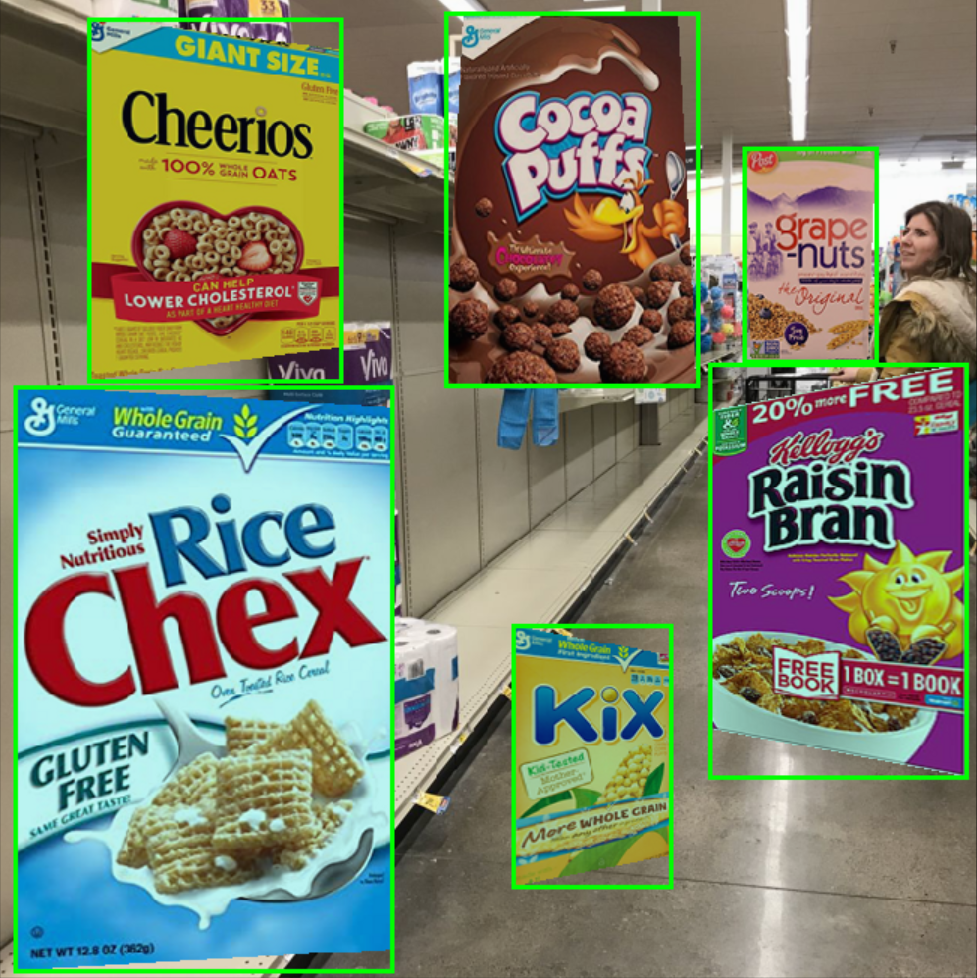

# Cereal Killer
An app to help people with food allergies quickly find breakfast cereals at the grocery store that are safe for them. The user indicates their allergies and uploads an image of multiple cereal boxes on the shelf. The app returns an annotated image indicating cereals that are safe, unsafe, and uncertain. Deployed on AWS at [www.cerealkiller.xyz](http://www.cerealkiller.xyz).

Developed as a fellow at Insight Data Science.

## Data sources
Generated artificial training data of cereal boxes with projective transformations superimposed on scenes of grocery store shelves. Example:

## Dependencies
- Python 3.7 (including Numpy, pandas, Flask, sqlalchemy, Keras, BeautifulSoup, matplotlib, PIL)
- MySQL

## Algorithm development and validation
- `generate_training.py` - create synthetic training data for box detection
- `image_processing.py` - helper functions for generating training data
- `finetune_YOLOv3_Colab.ipynb` - Colab notebook for fine-tuning YOLOv3
- `prediction_utils.py` - utilities for identifying a box given an image
- `box_detector_validation.py` - calculate mean intersection over union for all test images
- `text_validation.py` - performance metrics for text recognition and string matching

## Application
- `main.py` - run Flask app
